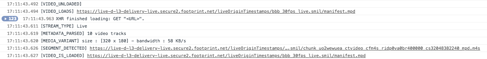

# shaka-player

## We need to go deeper

### How to use it ?

```
git clone https://github.com/DiMatteoL/shaka-player.git
cd shaka-player
```

If you are using node.js
```
npm install
node .
```
If you want to use python
```
python -m SimpleHTTPServer 5000
```

and then, go on http://localhost:5000/index.html

#### MP4 and DASH

MP4 files are great when it comes to local video playback, but they are files, which means they have no adaptive behaviour. If an internet speed is too slow or too unstable to load the file, well to bad!

DASH on the other hand is ( as its name suggests ) dynamic and adaptive. So not only does it break the video in multiple segments, but it actively scans your bandwith to give you the video segment that is suited for your current internet speed.

#### MSE and DASH

MSE allows the browser to attach a video element to a buffer instead of a file. You can then fill that buffer yourself, and load the video in chunks, each chunk is independent from the others and can have different qualities (like a lower bandwidth for exemple).

So browsers that do not natively support DASH can always rely on MSE to create the video buffer from the DASH segments.

#### A player lifecycle

Without any configuration, here is what I managed to get : 



So, in short : 
* The previous video is unloaded.
* The new one starts loading.
* The streamEvent starts as the manifest is requested. 
* Then tracks are sent (it can go from 9 to 45 different tracks from what I've seen). The first active track is always the lightest one (This is an improvement point ! It would be better to configure the player to first send a request to get the user's bandwidth, so that the first track is the one with the right quality).
* The video then leaves its loading state and the first media segment is received. (It is a bit different from what I've got, but I've done it wrong).
* Then more tracks are sent and the active track changes to be on the right bandwidth.

Configuring the player seems necessary to get on the same level as most other streaming websites. (like the bufferingGoal and reBufferingGoal)

#### Live vs VoD

From what I got, a VoD has every segment of the video ready at all time, meaning you can access the last segment reference even if you are currently only playing the first one. 

A live stream on the other hand only sends segments one by one, and you can access the latest segment by looking on position 0 of the current period>variant>variant>video.

